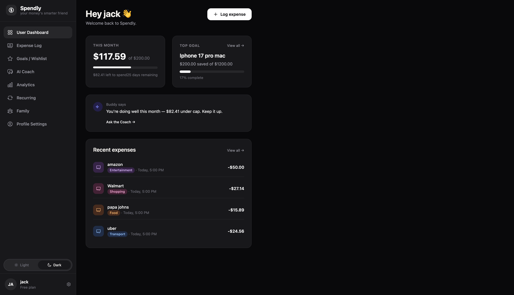
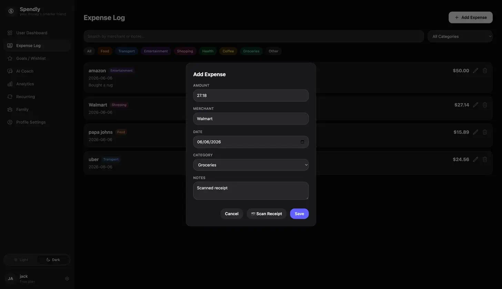
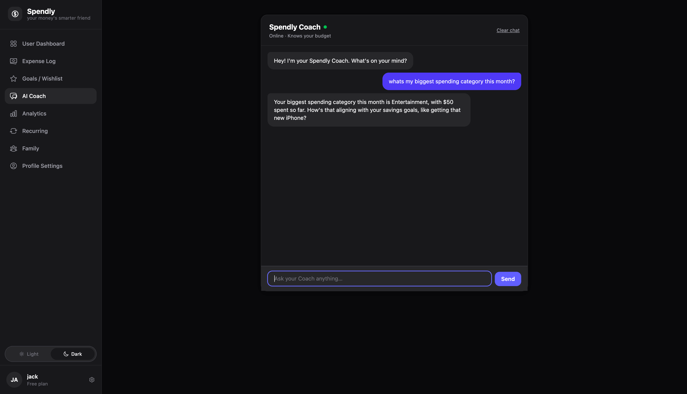
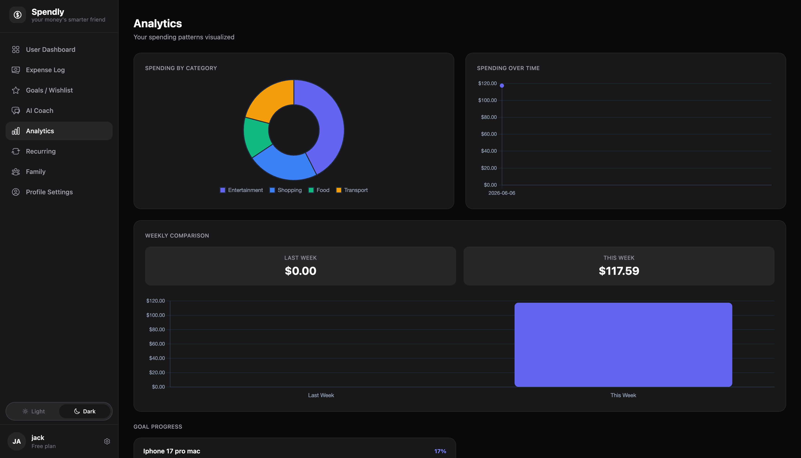

# Spendly

> Your money's smarter friend 💸

Spendly is a personal-finance app for high school students learning to manage their own money. It pairs everyday expense tracking and savings goals with an AI Coach that reads the user's actual budget, expenses, and detected recurring subscriptions before answering — so the advice is grounded in their real situation, not generic tips.

## Screenshots


*The Spendly dashboard*


*Scan a receipt, auto-fill the form*


*AI Coach grounded in real user data*


*Spending breakdown and weekly comparison*

## Features

- **Expense log** — full CRUD for expenses with category, merchant, date, and notes.
- **Savings goals** — multiple goals with target amount, progress, and deadline; one is auto-created from the onboarding survey when applicable.
- **AI Coach** — chat assistant powered by Groq (`llama-3.3-70b-versatile`), streamed over Server-Sent Events. The system prompt is rebuilt each turn from the user's profile, expenses, goals, and detected recurring subscriptions.
- **Receipt Scanner** — upload a receipt image; a Groq vision model (`meta-llama/llama-4-scout-17b-16e-instruct`) extracts amount, merchant, date, and category, then pre-fills the Add Expense form.
- **Analytics** — category pie, weekly comparison line chart, and goal progress, drawn with Chart.js.
- **Recurring subscriptions** — detects recurring charges from expense history and lets users mark them cancelled (with known cancel links for common services).
- **Family & allowances** — parent accounts create a family with an invite code; child accounts join with the code, receive scheduled recurring allowances, and split each one across save / spend / give buckets with AI suggestion and AI grading.
- **Financial onboarding survey** — gates the dashboard until the user completes a 13-field profile (living situation, income, food, savings goals, spending style).
- **Extended user profile** — username, email, school, graduation year, monthly budget cap, profile-picture upload, plus a separate change-password endpoint.
- **Dark / light theme** — toggle persisted to `localStorage`.
- **Admin dashboard** — admin-only toggles for maintenance mode, AI Coach, Receipt Scanner, and a tip-of-the-day message; admin is granted at registration via an admin code.
- **Demo mode** — three preset accounts (`maya`, `parent_demo`, `kid_demo`) whose writes are intercepted by middleware and never persisted.
- **Session-based auth** — bcrypt-hashed passwords, `express-session` cookies, route guards (`requireAuth`, `requireAdmin`, `requireParent`, `requireChild`).

## Tech stack

- **Runtime:** Node.js + Express 4
- **Auth:** `express-session`, `bcryptjs`
- **AI:** `groq-sdk` (Llama 3.3 70B for chat / grading / allocation suggestion, Llama 4 Scout for receipt vision)
- **Uploads:** `multer` — memory storage for receipts, disk storage for profile pictures; 5 MB limit, JPEG/PNG/WebP/HEIC accepted
- **Config:** `dotenv`
- **Frontend:** plain HTML + vanilla JS, Tailwind v4 browser build via CDN, Chart.js 4 via CDN (no build step)
- **Storage:** JSON files in `data/` (no database)

## Setup

```bash
git clone https://github.com/KevinIbarra547/Spendly-Ai.git
cd Spendly-Ai
npm install
```

Create a `.env` file at the repo root:

```
SESSION_SECRET=<any long random string — required; the server exits on boot if missing>
GROQ_API_KEY=<your Groq API key — required for the AI Coach and Receipt Scanner>
ADMIN_CODE=<optional; if unset, a built-in default is used>
```

Run the server:

```bash
npm start
```

Listens on `process.env.PORT` or **3000** by default. Visit `http://localhost:3000`.

Optional — seed the three demo accounts (`maya` / `parent_demo` / `kid_demo`, password `demo1234`):

```bash
npm run seed-demo
```

## Project structure

```
server.js                Express app, session middleware, route mounting, allowance scheduler
package.json             Dependencies and npm scripts
middleware/
  auth.js                requireAuth, requireAdmin, requireParent, requireChild, demoModeGuard
routes/
  auth.js                Register, login, logout, /me, profile PATCH, onboarding survey, change-password, PFP upload
  expenses.js            Expense CRUD, goals CRUD, recurring detection / cancel / restore
  ai.js                  /coach (SSE stream), /scanner (vision), /suggest-allocation, /grade-allocation
  admin.js               /config — admin-only site toggles
  family.js              Family/invite, allowances, allocations, parent notes, child dashboard
data/                    JSON "database" — users, expenses, goals, families, recurringAllowances, site_config
public/
  *.html                 One page per feature (dashboard, expenses, goals, coach, scanner, analytics, …)
  js/                    Page scripts (one per HTML file) plus the shared sidebar.js
  css/style.css          Theme variables and shared styles
  uploads/pfps/          User-uploaded profile pictures
scripts/seed-demo.js     Re-creates the three demo accounts and their seed data
docs/screenshots/        README screenshots
```

## Team

- **Kevin Ibarra** — AI Lead (Receipt Scanner, AI Coach, final polish)
- **Nolan** — Frontend Lead (all pages, Tailwind, Chart.js)
- **Kayden** — Backend Lead (Express, auth, CRUD, admin)

## Status

Built as a Web Page Design class project, Spring 2026.
